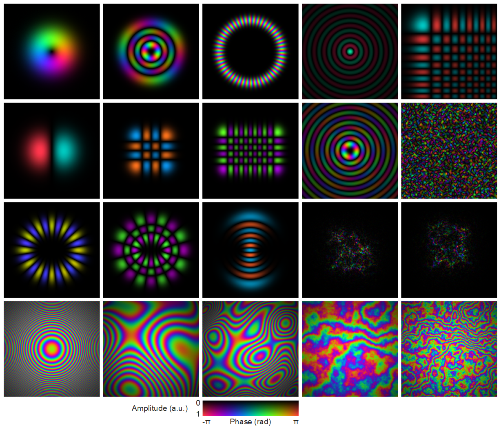
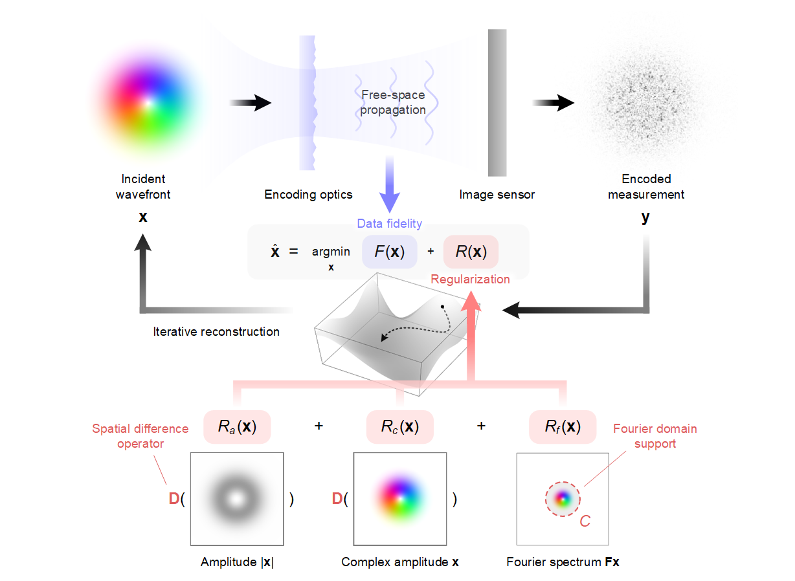

# **SAFARI**: **S**patial **A**nd **F**ourier-dom**A**in **R**egularized **I**nversion for complex wavefront characterization

Authors: **[Yunhui Gao](https://github.com/Yunhui-Gao)**, **[Liangcai Cao](https://scholar.google.com/citations?user=FYYb_-wAAAAJ&hl=en)**, and **[Din Ping Tsai](https://www.cityu.edu.hk/stfprofile/dptsai.htm)**

:school: *[**HoloLab**](http://www.holoddd.com/), Tsinghua University*, and *[**Meta-Devices Lab**](https://dinpingtsai.wixsite.com/mysite), City University of Hong Kong*


<p align="left">

</p>


**SAFARI** is a general inverse problem framework for wavefront recovery. It leverages the intrinsic physical properties of wavefronts and enables single-shot characterization of diverse classes of complex optical wavefronts, including **structured beams**, **aberrations**, and **speckle fields**.

## News

- 2025.06 :fire: MATLAB code released!


## Requirements
- The code has been implemented using Matlab 2022b. Older visions may be sufficient but have not been tested.

## Quick Start
Run [`demo_sim.m`](https://github.com/THUHoloLab/SAFARI/blob/master/demo_sim.m) with default parameters. Set `gpu = true;` in the code to enable GPU usage.

We have included the example code for generating different types of wavefront, which are listed below. To simulate the desired wavefront, simply uncomment the corresponding block in [`demo_sim.m`](https://github.com/THUHoloLab/SAFARI/blob/master/demo_sim.m).

<details>
<summary> Generation of <strong>speckel fields</strong></summary>

```matlab
rng(0)                          % random seed, for reproducibility
grain_size = 8;                 % speckle grain size (pixel)
m = round(n/grain_size);        % number of speckles in one dimension
m = round((m+1)/2)*2;           % make m an even number
u = exp(1i*rand(m,m)*2*pi);     % random phase uniformly sampled in [0,2pi)
wavefront = fftshift(fft2(fftshift(zeropad(u,(n-m)/2)))); % fft to obtain speckles
```

</details>

<details>
<summary> Generation of <strong>Laguerre-Gaussian beams</strong></summary>

```matlab
[X,Y] = meshgrid((-n/2:n/2-1)*params.pxsize);   % define 2D coordinate (mm)
z = 0;      % z position (mm)
w0 = 0.2;   % beam waist (mm)
l = 3;      % azimuthal index
p = 3;      % radial index
wavefront = genLaguerreGaussian(X,Y,z,params.wavlen,w0,l,p);
```

</details>

<details>
<summary> Generation of <strong>Hermite-Gaussian beams</strong></summary>

```matlab
[X,Y] = meshgrid((-n/2:n/2-1)*params.pxsize);   % define 2D coordinate (mm)
z = 0;      % z position (mm)
w0 = 0.2;   % beam waist (mm)
mi = 3;     % mode index
ni = 3;     % mode index
wavefront = genHermiteGaussian(X,Y,z,params.wavlen,w0,mi,ni);
```

</details>

<details>
<summary> Generation of <strong>Ince-Gaussian beams</strong></summary>

```matlab
z = 0;      % z position (mm)
w0 = 0.2;   % beam waist (mm)
p = 12;     % order 
m = 8;      % degree
e = 2;      % ellipticity parameter
parity = 0; % parity of the beam (0: even, 1:odd)
wavefront = genInceGaussian(params.pxsize*n/2,n+1,parity,p,m,e,w0,2*pi/params.wavlen,z);
wavefront = wavefront(1:n,1:n);
```

</details>

<details>
<summary> Generation of <strong>Airy beams</strong></summary>

```matlab
[X,Y] = meshgrid((-n/2:n/2-1)*params.pxsize);   % define 2D coordinate (mm)
w0 = 0.2;                       % scaling factor
x0 = -n*0.4*params.pxsize;      % x center location (mm)
y0 = -n*0.4*params.pxsize;      % y center location (mm)
a = 1e-3;                       % exponential truncation factor
wavefront = genAiry(X,Y,w0,x0,y0,a);
```

</details>

<details>
<summary> Generation of <strong>Bessel beams</strong></summary>

```matlab
[X,Y] = meshgrid((-n/2:n/2-1)*params.pxsize);   % define 2D coordinate (mm)
z = 0;              % z position (mm)
n_charge = 3;       % topological charge
theta = pi/3e3;     % axicon angle (rad)
wavefront = genBessel(X,Y,z,params.wavlen,n_charge,theta);
```

</details>

<details>
<summary> Generation of <strong>parabolic phase</strong></summary>

```matlab
[X,Y] = meshgrid((-n/2:n/2-1)*params.pxsize);   % define 2D coordinate (mm)
f = 200;    % focal length (mm)
a = 0.2;    % amplitude attenuation
k = 2*pi/params.wavlen;     % wave number
wavefront = exp(-a*(X.^2+Y.^2)) .* exp(-1i*k*(X.^2+Y.^2)/2/f);
```

</details>

<details>
<summary> Generation of <strong>Zernike aberrations</strong></summary>

```matlab
[X,Y] = meshgrid(linspace(-1,1,n));     % define 2D coordinate
[theta,r] = cart2pol(X,Y);              % convert to polar coordinate
idx = r <= 1;                           % define the circular aperture
n_max = 5;                              % define maximum Zernike order
s_fac = 4;                              % define scaling factor controlling the dynamic range
n_modes = (n_max+2)*(n_max+1)/2;        % number of Zernike modes
z_n = nan(n_modes,1);
z_m = nan(n_modes,1);
for i = 0:n_max
    z_n(i*(i+1)/2+1:(i+1)*(i+2)/2) = i;
    z_m(i*(i+1)/2+1:(i+1)*(i+2)/2) = -i:2:i;
end
rng(0)                                  % set random seed, for reproducibility
coef = 2*rand(n_modes,1)-1;             % uniformly sample Zernike coefficients between [-1,1]
zer = zeros(n,n);
for i = 1:n_modes
    bfun = zeros(n,n);
    bfun(idx) = zernfun(z_n(i),z_m(i),r(idx),theta(idx));
    zer(idx) = zer(idx) + coef(i)*bfun(idx);
end
phase = 2*pi*s_fac*zer;                 % scale the phase profile
phase = imresize(phase(ceil(n/2-sqrt(2)/4*n+1):floor(n/2+sqrt(2)/4*n-1),...
    ceil(n/2-sqrt(2)/4*n+1):floor(n/2+sqrt(2)/4*n-1)),[n,n]);   % crop the central rectangular region
a = 1;    % amplitude attenuation
wavefront = exp(-a*(X.^2 + Y.^2)).*exp(1i*phase);
```

</details>

<details>
<summary> Generation of <strong>Fourier phase screens</strong></summary>

```matlab
seed = 0;       % set random seed, for reproducibility
numsub = 10;    % number of subharmonics for subharmonic sampling
r0 = 0.1;       % Fried parameter (mm)
phase = FourierPhaseScreen(n,params.pxsize,r0,seed,numsub);     % calculate phase screen
[X,Y] = meshgrid((-n/2:n/2-1)*params.pxsize);   % define 2D coordinate (mm)
a = 0.1;        % amplitude attenuation
wavefront = exp(-a*(X.^2 + Y.^2)).*exp(1i*phase);
```

</details>

<details>
<summary> Generation of <strong>turbulence</strong></summary>

```matlab
rng(0)          % set random seed, for reproducibility
n_screen = 10;  % number of phase screens
D1 = 5;         % length of one side of square phase screen (m)
D2 = 1;         % diameter of the observation aperture (m)
Dz = 2e5;       % propagation distance (m)
wavefront = genTurbulence(n,n_screen,D1,D2,Dz,params.wavlen*1e-3);
```

</details>

<details>
<summary> Generation of <strong>amplitude targets</strong></summary>

```matlab
img = im2double(imread('data/thulogo.bmp'));
img = imresize(img,[n/2,n/2]);
img = padarray(1-img,[n/4,n/4],0);
amp = img;
pha = zeros(n,n);
wavefront = amp.*exp(1i*pha);
```

</details>

<details>
<summary> Generation of <strong>phase targets</strong></summary>

```matlab
img = im2double(imread('data/cityulogo.bmp'));
img = imresize(img,[n/2,n/2]);
img = padarray(1-img,[n/4,n/4],0);
amp = ones(n,n);
pha = img*pi;
wavefront = amp.*exp(1i*pha);
```

</details>

<details>
<summary> Generation of <strong>tilted wavefronts</strong></summary>

```matlab
[X,Y] = meshgrid((-n/2:n/2-1)*params.pxsize);   % define 2D coordinate (mm)
kmax = 2*pi/params.pxsize/4/2;
kx = kmax*0.5;
ky = kmax*0.0;
pha = kx*X + ky*Y;
amp = ones(n,n);
wavefront = amp.*exp(1i*pha);
```

</details>


## Theory and principle

<p align="left">

</p>
